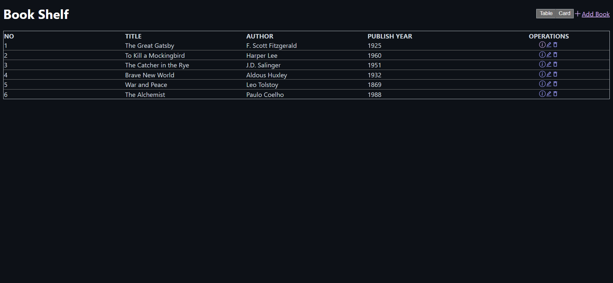
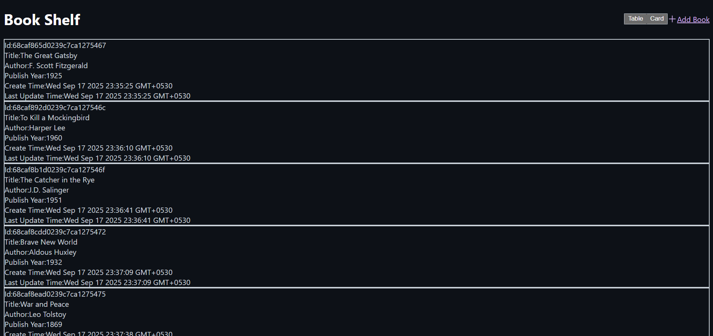
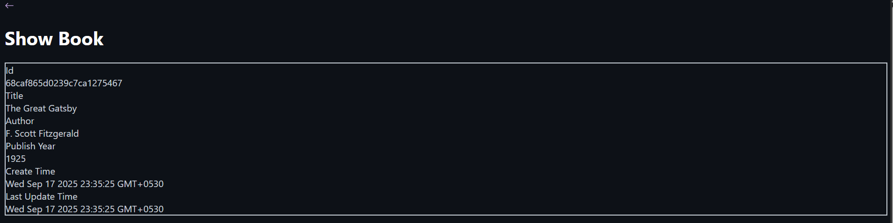

# 📚 MERN Stack Book Management System (Book Shelf)

## Table of Contents
1. [Project Overview](#1-project-overview)
2. [Features](#2-features)
3. [Tech Stack](#3-tech-stack)
4. [Live Demo](#4-live-demo)
5. [Installation and Setup](#5-installation-and-setup)
6. [Screenshots](#6-screenshots)

---

## 1. Project Overview

This is a full-stack web application developed using the **MERN (MongoDB, Express, React, Node.js) stack** designed to efficiently manage a book collection. The application successfully implements all four core **CRUD (Create, Read, Update, Delete)** operations via a robust RESTful API.

**Goal:** To provide a clean, responsive, and fully functional interface for users to catalogue and track essential book metadata (Title, Author, Publish Year).

## 2. Features

### Core CRUD Functionality
* **Create Book:** Add new book records via a dedicated input form.
* **Read Books:** Retrieve and display the full list of books from the MongoDB database.
* **View Details:** Dedicated detail page for each book, displaying the unique MongoDB ID, Creation Timestamp, and Last Update Timestamp.
* **Update Book:** Edit existing book records using pre-filled forms.
* **Delete Book:** Remove a book entry from the database.

### Data Presentation & User Interface (UI)
* **Dynamic Views:** Users can toggle between two primary views for data presentation: a **Table View** (for easy scanning of key data) and a **Card View** (for a visually rich presentation of each record).
* **Operations Controls:** Inline icon buttons on the list view enable quick access to **View Details**, **Edit**, and **Delete** actions.
* **Responsive Design:** Ensures usability across various screen sizes.

## 3. Tech Stack

| Category | Technology | Purpose |
| :--- | :--- | :--- |
| **Frontend** | **React.js** | Built the single-page application (SPA) and managed component state. |
| **Backend** | **Node.js & Express.js** | Created the RESTful API endpoints and handled server-side logic. |
| **Database** | **MongoDB** | Used a NoSQL database for flexible and scalable document storage, including automatic generation of `_id`, `createdAt`, and `updatedAt` timestamps. |
| **Deployment** | **Vercel** | Platform used for continuous deployment of the client application. |

## 4. Live Demo

You can view and interact with the live deployed version of the application here:

👉 **(https://book-store-mern-stack-opal.vercel.app/)**

## 5. Installation and Setup
*(Keep this section the same as the previous version, detailing the steps for cloning, environment setup, and running the backend and frontend.)*

### Prerequisites
* Node.js (v18+)
* npm (v9+) or yarn
* A MongoDB connection URI

### 5.1. Cloning the Repository

git clone [https://github.com/YASHWANTHGUNA/book-store-mern-stack]
cd book-store

## 6. Screenshots

### 6.1. Book List - Table View
The default view for efficient scanning of key book data, featuring inline CRUD operations.

### 6.2. Book List - Card View
An alternative, detailed presentation format showing MongoDB IDs, creation, and last update timestamps.

### 6.3. Individual Book Details
Dedicated page confirming the successful retrieval of a single record, including auto-generated MongoDB metadata.

### 6.4. Edit Book Functionality
The Edit Book form, demonstrating successful pre-population of fields for modifying an existing record.

## 7. Project Maintainer

**[G.YASHWANTH]**
* **GitHub:** [https://github.com/YASHWANTHGUNA]
* **LinkedIn:** [https://www.linkedin.com/in/yashwanth-guna-b61099292/]
